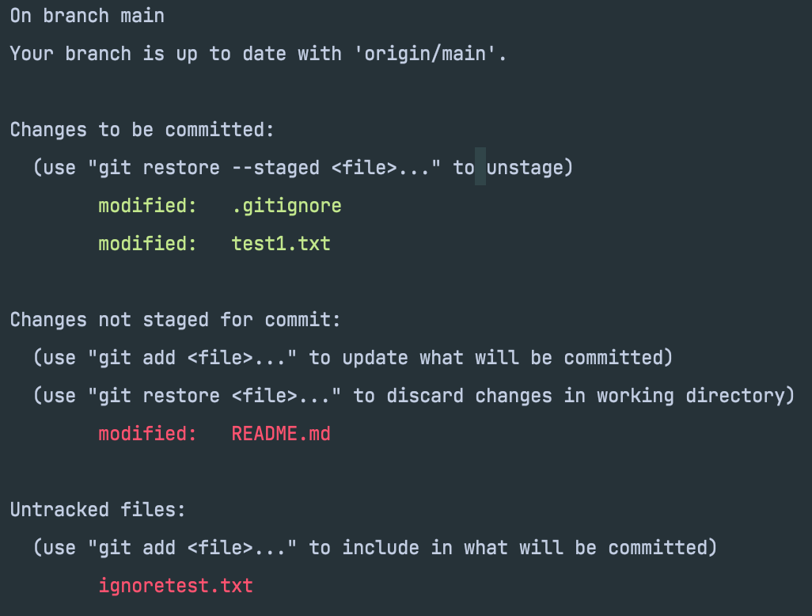
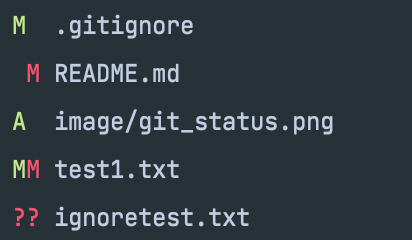

# git test

## 목차

[1. git 구조](#1.-git-구조)

[2. repository 생성](#2.-repository-생성)

[3. git status](#3.-git-status)

[4. git add](#4.-git-add)

---
## Test 환경
- macOS Monterey (Apple silicon)
- git version 2.34.0
- zsh
---
## 1. git 구조


- Working Directory: 개인 PC에서 작업하고자 하는 디렉토리(폴더) -> .git 폴더의 상위 폴더


- Staging Area: git [`add`](#4.-git-add)를 하게되면 **잠시** 저장되는 공간 -> .git 폴더안에 index파일형태로 저장됨 -> 이 경우 아직 버전관리가 안됨


- Local Repository: Staging Area에 [`add`](#4.-git-add)한 파일들을 `commit` 하게되면 저장되는 공간 -> .git 폴더안의 object에 저장


- Remote Repository: 나의 pc가 아닌 github와같은 외부 저장공간
---
## 2. repository 생성


    
```bash
echo "# git_test" >> README.md
git init
git add README.md
git commit -m "first commit"
git branch -M main
git remote add origin https://github.com/SongSiWoon/git_test.git
git push -u origin main
```


1. `echo "{파일 내용}" >> {파일 이름}` : 새로운 파일 생성
2. `git init` : local(개인 pc)의 저장하고자하는 디렉토리(폴더)에 git 저장소 생성
3. 1번에서 만들어둔 README.md 파일을 2번에서 만든 .git 폴더의 staging area(index)에 저장
4. 3번에서 저장해논 내용을 `commit` 메세지(-m 뒤 "(내용)")와 함께 하나의 버전으로 local repository(.git 폴더)에 저장
5. `branch` 이름 main 으로 변경
6. local repository(내 pc의 .git 폴더)와 remote repository(github) `origin` 이라는 이름으로 연결
7. 4번에 local repository에 저장해둔 버전을 `origin` remote repository의 main브랜치에 저장

---
## 3. git status

- git 프로젝트 파일들의 상태를 확인하는 명령어 (add, commit 전 한 번씩 확인)


- Tracked vs Untracked -> `gitignore`에 추가했는지에 따라서


- Modified vs Unmodified -> 수정되었는지에 따라서


- Staged vs Unstaged -> `add`를 했는지에 따라서




- 위의 사진에서 보면 터미널에 나타나는 상황은 3가지 경우로 나뉨

    1. **Untracked files**: `.gitignore`에 등록되어 더 이상 `git`이 관리하지 않는 파일
    
    2. **Changes not staged for commit**: modified(수정됨)파일이 아직 `add`되지않아 Staged Area에 올라가지 않은 상태
    
    3. **Changes to be committed**: Staged Area 즉 `add`가 완료된 파일들 따라서 commit 하여 local repo에 저장해주면 된다. 


- `git status -s`

- 상태 간략하게 보기 

- 수정되었으며 `add`한 상태
- 수정되었지만 `add`하지 않은 상태
- 새로운 파일을 수정없이 `add`한 상태
- 수정후 `add`하고 나서 다시 수정한 부분은 `add` 안된 상태
- `Untracked` 상태


---
## 4. git add


- 작업 디렉토리에서 변경된 내용을 **StagingArea**에 추가하는 명령어


### Staging Area
- d


--
