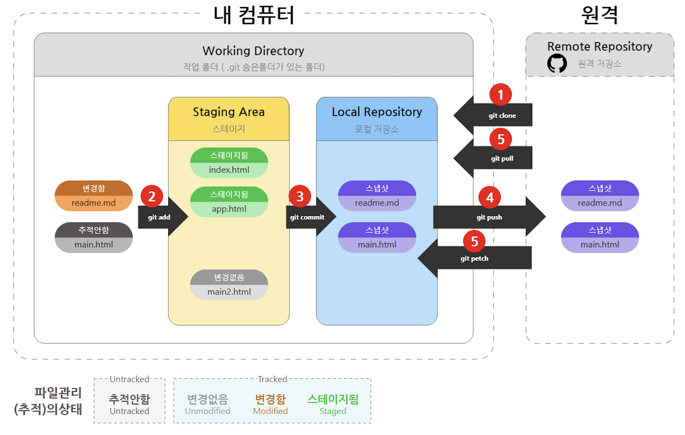

# git test

## 목차

[1. git 구조](#1.-git-구조)

[2. repository 생성](#2.-repository-생성)

---
## 1. git 구조

- Working Directory: 개인 PC에서 작업하고자 하는 디렉토리(폴더) -> .git 폴더의 상위 폴더

- Staging Area: git add를 하게되면 **잠시** 저장되는 공간 -> .git 폴더안에 index파일형태로 저장됨 -> 이 경우 아직 버전관리가 안됨

- Local Repository: Staging Area에 add한 파일들을 commit 하게되면 저장되는 공간 -> .git 폴더안의 object에 저장

- Remote Repository: 나의 pc가 아닌 github와같은 외부 저장공간
---
## 2. repository 생성

    ''' bash

    1. echo "# git_test" >> README.md
    2. git init
    3. git add README.md
    4. git commit -m "first commit"
    5. git branch -M main
    6. git remote add origin https://github.com/SongSiWoon/git_test.git
    7. git push -u origin main

    '''

1. echo "{파일 내용}" >> {파일 이름} : 새로운 파일 생성
2. git init : local(개인 pc)의 저장하고자하는 디렉토리(폴더)에 git 저장소 생성
3. 1번에서 만들어둔 README.md 파일을 2번에서 만든 .git 폴더의 staging area(index)에 저장
4. 3번에서 저장해논 내용을 commit 메세지(-m 뒤 "(내용)")와 함께 하나의 버전으로 local repository(.git 폴더)에 저장
5. branch 이름 main 으로 변경
6. local repository(내 pc의 .git 폴더)와 remote repository(github) "origin" 이라는 이름으로 연결
7. 4번에 local repo에 저장해둔 버전을 "origin" remote repo의 main브랜치에 저장